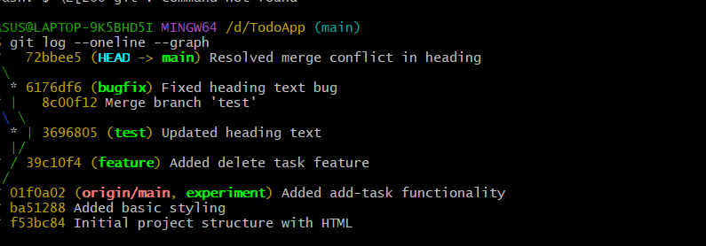
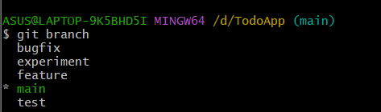
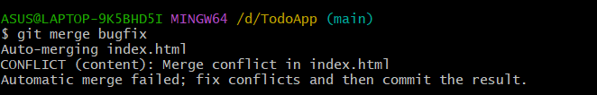
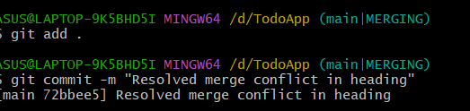

# To-Do App – Git Bash & GitHub Project

## Introduction
This project is a simple To-Do Application developed using HTML, CSS, and JavaScript. 
The application helps users manage their daily tasks by allowing them to add and delete tasks easily.
This project was created as part of the Version Control Systems / DevOps course to demonstrate practical usage of Git Bash and GitHub.

---

## Project Objectives
- To build a simple and user-friendly task management application
- To practice Git and GitHub commands
- To understand version control concepts such as commits, branches, and merges
- To demonstrate merge conflict creation and resolution

---

## Technologies Used
- HTML
- CSS
- JavaScript
- Git Bash
- GitHub
- VS Code

---

## Git Commands Used
The following Git commands were used in this project:

- `git init` – Initialize local Git repository
- `git status` – Check file status
- `git add .` – Stage changes
- `git commit -m "message"` – Commit changes
- `git branch` – View branches
- `git checkout -b branch-name` – Create and switch branch
- `git merge branch-name` – Merge branches
- `git remote add origin <url>` – Connect to GitHub repository
- `git push origin main` – Push code to GitHub
- `git log --oneline --graph` – View commit history

---

## Branches Used
The following branches were created and used:
- main
- feature
- test
- bugfix
- experiment

---

## Merge Conflict Demonstration
A merge conflict was intentionally created by modifying the same line of code in different branches.
The conflict was resolved manually by editing the file and committing the resolved version.

---

## Screenshots

### Git Commit History

### Git Branches

### Merge Conflict

### Conflict Resolution

## Challenges Faced
- Understanding branch merging
- Resolving merge conflicts manually
- Managing multiple commits and branches
- Learning proper Git workflow

---

## Conclusion
This project provided hands-on experience with Git and GitHub.
It helped in understanding version control concepts, branching strategies, and conflict resolution.
The project also improved basic frontend development skills and practical DevOps knowledge.
